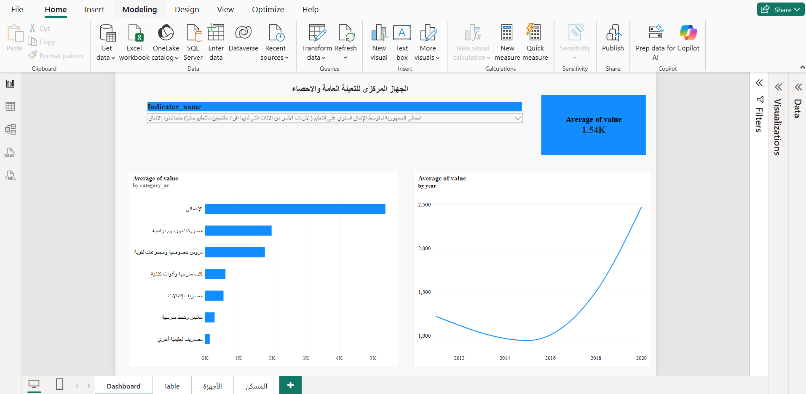

# Capmas-Dashboard
# CAPMAS Household Income & Living Standards Dashboard

An end-to-end data pipeline and interactive dashboard analyzing household
income and living standards data published by Egypt's Central Agency for
Public Mobilization and Statistics (CAPMAS).

## Overview

This project automates the full workflow from raw government data to a
live, interactive dashboard:

1. Extract (Python) - Pulls indicator data directly from CAPMAS's
   public API using the requests library, covering 200+ indicators
   under the Income and Living Standards (Household Budget) subject.
2. Transform (Power Query) — Cleans and reshapes the raw JSON output
   into a structured, analysis-ready table: correcting data types,
   unpivoting category/year values, and separating aggregate totals
   from category-level breakdowns.
3. Load & Visualize (Power BI) — Builds an interactive dashboard with
   indicator selection, year-over-year trend charts, and category
   comparisons.

## Tech Stack

- Python ; requests, pandas for data extraction
- Power Query (M); data cleaning and transformation
- Power BI;  interactive data visualization and dashboarding

## Data Source

Central Agency for Public Mobilization and Statistics (CAPMAS)
https://www.capmas.gov.eg

## Project Files

- webscraping.py ; extraction script that pulls indicator data from
  the CAPMAS API
- all_indicators_subsubject22.xlsx ; cleaned dataset output
- Campas_dashboard.pbix; Power BI dashboard file

## Key Features

- Dynamic indicator selector (slicer) to explore any of 200+ indicators
- Year-over-year trend visualization (2011–2020)
- Category-level comparison charts
- Automated, repeatable data extraction (no manual scraping required)
